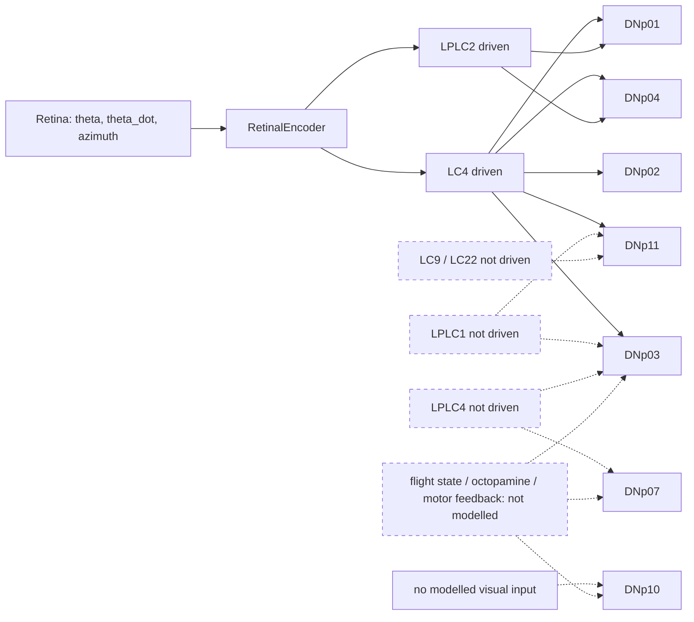

# M1.8-N4B8: biological long-mode escape pathway feasibility

Status: **research only; complete. Outcome C: no useful long-mode signal found.**

- No runtime code, configuration, decoder, whitelist, Retina / encoder equation, MaleCNS
  parameter, brain noise, physics, controller, geometry or lifecycle was changed.
- No decoder, threshold, window, weighting or gate was built.
- The accepted runtime (M1.8-N4B5R, `feature/m1-8-n4b5r-geometry` @ `363a1a9`) was used
  read-only and stayed clean.

## Short answer

**The adult Drosophila literature does support a distinct long-mode escape pathway.**

- Short-mode takeoffs are GF (DNp01)-driven.
- Long-mode takeoffs come from parallel descending pathways; the LC4-glomerulus DNs
  DNp02, DNp04 and DNp11 can drive them.
- Separately, flies distinguish "approaching object" contexts from escape contexts
  largely by **behavioural-state gating** (landing DNs DNp07 / DNp10 are visually
  responsive only in flight), **not by a visual code that separates predator looming from
  self-motion looming**.

**Under the current MaleCNS + sensory representation, no biologically motivated candidate
provides a usable, more selective slow-approach signal.** Per the preregistered rule the
outcome is **C**:

| Candidate | Literature role | 130 units/s separable from baseline (AUC, A2 / C2 / C3) | Why it does not help |
|---|---|---|---|
| DNp02 | long-mode takeoff (backward) | 0.87 / 0.76 / 0.96 | weaker than DNp01 / DNp04 (it receives the same LC4 input and no LPLC2), and not selective |
| DNp11 | long-mode takeoff (forward) | 0.64 / 0.64 / 0.77 | weak; about 45 % of its visual input comes from projection neurons the simulator does not drive |
| DNp03 | flight-evasion saccades | 0.51 / 0.55 / 0.52 | dominated by LPLC1 / LPLC4 input, which the simulator does not drive |
| DNp07, DNp10 | landing (flight-gated) | about 0.5 | **no modelled visual input at all** |
| DNp01 / DNp04 (references) | fast escape / long-mode | 1.00 | the only cells with a slow-approach signal; already shown non-selective in free flight (N4B2, N4B3, N4B7) |

**Decisive structural test: the self-motion mirror.**

- The paddle is parked and the fly is moved along the exact relative path of the 130 or
  300 units/s approach.
- The Retina input is **bit-identical** (maximum difference 0.0) and **every candidate
  cell's spike train is identical in 48 / 48 seeds** for both speeds.
- In this simulator the brain's only visual input is the Retina triple (theta, theta_dot,
  azimuth), relayed through LC4 / LPLC2. There is no optic flow, efference copy,
  proprioception or flight-state input.
- **So no neuron anywhere in the connectome can distinguish external from self-generated
  approach with the same relative geometry.**

**Architecture recommendation:** document slow-approach insensitivity as an accepted model
limitation of the current architecture. A future long-mode channel would first need
**new information in the brain's input**, not a new readout:

- flight / behavioural-state gating;
- self-motion visual cues or efference copy;
- the missing looming VPN channels (LPLC1, LPLC4).

Each of these is an architecture or biological-model change that needs explicit approval.
**N4B8 stops here.**

## 1. Question

N4B7 closed the DNp01 long-window route: a 1 s DNp01 count detects 130 units/s approaches
but fires on self-approach in free flight. N4B8 asks whether biology and the connectome
offer a **different** pathway, a long-mode or slower visual avoidance channel, that could
handle gradual looming more selectively. This is a feasibility study; nothing is optimised.

## 2. Primary-literature review

Evidence classes:

- **A** directly demonstrated biology;
- **B** anatomical / connectomic inference;
- **C** simulator engineering interpretation (section 7).

"Responds to looming" is not taken to mean "causes escape".

| # | Finding | Class | Source |
|---|---|---|---|
| L1 | Looming evokes either a long-duration takeoff sequence (stable flight) or a short-duration sequence that trades stability for speed. GF spike timing relative to parallel descending circuits selects between them; the GF has a higher activation threshold but can override and force a short takeoff. | A | von Reyn et al. 2014, *Nat Neurosci* 17:962 ([PubMed](https://pubmed.ncbi.nlm.nih.gov/24908103/)) |
| L2 | One VPN type conveys angular expansion velocity to the GF escape circuit, others convey angular size; linear feature integration in the GF drives probabilistic escape. | A | von Reyn et al. 2017, *Neuron* 94:1190 ([Cell](https://www.cell.com/neuron/fulltext/S0896-6273(17)30474-9)) |
| L3 | LPLC2 provides size encoding and LC4 velocity encoding to the GF, via direct synapses. | A | Ache et al. 2019, *Curr Biol* 29:1073 ([ScienceDirect](https://www.sciencedirect.com/science/article/pii/S0960982219301381)) |
| L4 | LPLC2 is an ultra-selective looming detector. Radial motion opponency (outward-motion excitation, inward-motion inhibition on each dendritic arm) rejects related patterns such as contraction or rotation. | A | Klapoetke et al. 2017, *Nature* |
| L5 | Two neurons postsynaptic to a looming VPN type (LC4) promote **opposite takeoff directions**; LC4 synaptic-weight gradients onto them convert looming location into escape direction. Identified as DNp02 and DNp11 in the paper and its figures. | A | Dombrovski et al. 2023, *Nature* 613:534 ([Nature](https://www.nature.com/articles/s41586-022-05562-8)) |
| L6 | "LC4DNs" (DNs with dendrites in the LC4 glomerulus, parallel to the GF) can evoke **long-mode** escapes. DNp11 gives forward jumps; DNp02 + DNp04 co-activation gives backward jumps. LC4DNs share similar looming sensitivity and speed tuning, "as would be expected from a common looming-sensitive input". | A (PhD dissertation, not peer-reviewed) | Peek 2018, University of Chicago ([record](https://knowledge.uchicago.edu/record/1415)) |
| L7 | DNp04 innervates the whole LC4 glomerulus and DNp02 its ventral part; nine DN types innervate the LC4 glomerulus. | B | Namiki et al. 2018, *eLife* 7:e34272 ([eLife](https://elifesciences.org/articles/34272)) |
| L8 | DNp02 receives LC4 but not LPLC2 synapses; DNp01 receives both. | B | Moreno-Sanchez et al. 2024, bioRxiv ([PMC](https://pmc.ncbi.nlm.nih.gov/articles/PMC11071487/)) |
| L9 | "An approaching predator and self-motion toward an object can generate similar looming patterns on the retina." Two DN types control landing (DNp07, DNp10). **Their visual responses are severely attenuated when not flying**: octopamine mimics flight for DNp07; DNp10 probably receives flight-motor feedback. | A | Ache et al. 2019, *Nat Neurosci* 22:1132 ([Nature](https://www.nature.com/articles/s41593-019-0413-4)) |
| L10 | DNp03 responds to ipsilateral looming in a flight-state-dependent way; sustained post-stimulus activity best predicts evasive flight saccades. | A | Buchsbaum et al. 2025, *Curr Biol* ([PubMed](https://pubmed.ncbi.nlm.nih.gov/39788121/)) |
| L11 | DNp03 receives direct input from LPLC1, LC4, LPLC4, LC22 and LC23. It is tuned to expansion over translation. Octopamine mimics flight. It outputs to wing and neck motor neurons and to DNa15 / DNb01. | A / B | Croke et al. 2025, *Curr Biol* ([PMC](https://pmc.ncbi.nlm.nih.gov/articles/PMC12977095/)) |
| L12 | Flying flies evade looming targets with rapid banked turns. | A | Muijres et al. 2014, *Science* |
| L13 | About 200 ms before takeoff, flies make visually guided postural adjustments. | A | Card & Dickinson 2008, *Curr Biol* |
| L14 | Visual neurons receive motor-related (efference-copy-like) inputs during flight turns that suppress their responses to self-generated motion. Suppression is specific to course-changing turns. | A | Kim et al. 2015, *Nat Neurosci*; Fenk et al. 2021, *Curr Biol* |
| L15 | Flight increases the gain of visual motion-processing interneurons. | A | Maimon et al. 2010, *Nat Neurosci* |
| L16 | Whether a threatened fly freezes or flees depends on its locomotor state (DNp09). | A | Zacarias et al. 2018, *Nat Commun* |

What this supports and what it does not:

- **Supported (A):** a slower, GF-independent long-mode takeoff exists. LC4-glomerulus DNs
  (DNp02, DNp04, DNp11) can drive it. Behavioural state (flight, locomotion) strongly gates
  which visuomotor pathway is used.
- **Not supported:** a demonstrated visual code by which a fly tells a slowly approaching
  predator from its own approach to an object.
  - The landing-versus-escape literature (L9) explicitly treats the two as retinally
    similar and resolves the conflict by state gating.
  - Self-motion compensation (L14, L15) is known for wide-field motion pathways during
    turns. It is not established for object looming during forward flight.
- **Not supported:** that any particular DN "integrates slowly" for gradual approach. The
  long-mode pathway is slower because it is a different motor program (L1, L6), not because
  it is demonstrated to integrate weak looming over seconds.

## 3. Frozen candidate set

The set was frozen in `tools/n4b8_candidates.py`, sha256
`9d0e99c552250e7015ff7ed5951daaa24bfd779232cb7abb8afc72811d297686`. It was committed and
pushed as `ecb86d3` after only the static connectome inspection and **before any N4B8
activity simulation**. `artifacts/m1_8_n4b8/preregistration.json` has sha256
`b130f10a...6463`.

| Candidate | Role | Basis |
|---|---|---|
| DNp01 | reference: accepted fast pathway | L1-L3 |
| DNp04 | reference baseline (known non-specific; not reopened) | L6, L7 |
| DNp02 | long-mode takeoff | L5, L6, L8 |
| DNp11 | long-mode takeoff | L5, L6 |
| DNp03 | flight evasion | L10, L11 |
| DNp07 | landing (self-motion toward an object) | L9 |
| DNp10 | landing (self-motion toward an object) | L9 |

- **Excluded:**
  - DNp06: looming-responsive, but no demonstrated takeoff or avoidance role;
  - the remaining LC4-glomerulus DNs;
  - the N4B2 comparison DNs.
- No unrestricted DN search was made. No candidate was added after the data were seen.

## 4. Connectome feasibility (MaleCNS graph, static)

Source: `tools/n4b8_long_mode.py connectome`, output `artifacts/m1_8_n4b8/connectome.json`
(sha256 `4899df68...75c7`).

- Weights are graph weights; the sign gives excitation (+) or inhibition (-).
- "Full-volley voltage" = gain (3.0) x the summed weight from the encoder's chosen
  ipsilateral LC4 + LPLC2 cells, compared with the 0.228 V rest-to-threshold margin.
- "Modelled VPN share" is the fraction of the cell's excitatory visual-projection-neuron
  input that comes from LC4 / LPLC2, the only VPN types the simulator drives
  (`sensory_input=False`).

| Cell (L / R) | Direct ipsilateral LC4 / LPLC2 (encoder cells) | Full-volley voltage / margin | Contralateral | Total excitatory / inhibitory input | Modelled VPN share | Largest VPN inputs (weight) | Main indirect paths from driven cells |
|---|---|---|---|---|---|---|---|
| DNp01 | 0.144 / 0.125; 0.161 / 0.138 | 3.5x / 3.9x | 0 | 0.65 / -0.35 | 1.00 | LC4 0.18, LPLC2 0.13 | SAD064, PVLP122b (+) |
| DNp04 | 0.442 / 0.158; 0.536 / 0.161 | 7.9x / 9.2x | 0 | 0.80 / -0.20 | 1.00 | LC4 0.56, LPLC2 0.16, MTe41 -0.03 | MTe41, cM19 (-) |
| DNp02 | 0.216 / 0; 0.244 / 0.001 | 2.9x / 3.2x | 0 | 0.66 / -0.34 | 0.98-0.99 | **LC4 only** (0.28 / 0.24) | SAD064 (+), DNg40 (-) |
| DNp11 | 0.135 / 0.005; 0.169 / 0.002 | 1.8x / 2.2x | 0 | 0.64 / -0.36 | **0.54-0.56** | LC4 0.17, LPLC1 0.05, LC9 0.04, LPLC4 0.01-0.02 | SAD064 (+), PVLP024 (-) |
| DNp03 | 0.134 / 0; 0.084 / 0 | 1.8x / 1.1x | 0 | 0.78 / -0.22 | **0.14-0.29** | **LPLC1 0.19-0.20, LPLC4 0.18-0.22**, LC4 0.08-0.17, LC22 0.03-0.04 | PVLP024, PVLP021 (-) |
| DNp07 | 0 / 0 | 0 | 0 | 0.67 / -0.33 | **0.00** | LPLC4 0.19-0.20, LTe64 0.06-0.08, LLPC3 0.03-0.04 | only weak, non-firing paths (LTe18, LPLC4) |
| DNp10 | 0 / 0 | 0 | 0 | 0.63 / -0.37 | **0.00** | tiny (MTe44, LC35, LLPC2, LC10d, each < 0.011) | PLP150, IB114 (weak) |

Pathway summary. The dashed boxes are anatomically real inputs that receive no drive in the
simulator.

Connectome conclusions:

- **B (anatomy):** the literature-backed long-mode DNs (DNp02, DNp11) take their modelled
  input from the same LC4 population as DNp01 and DNp04. DNp02 receives only LC4.
- **C (simulator):** these DNs therefore get a subset of the stimulus information DNp01 /
  DNp04 already get, with lower gain.
- **Representation gap (C):** the flight-evasion and landing DNs are driven mainly or
  entirely by VPN types the simulator does not model (LPLC1, LPLC4, LTe64, and others). Their
  biological state gating (octopamine, flight-motor feedback) is also absent. In the
  simulator they are essentially disconnected from vision.

## 5. Controlled N4B6 comparison

Setup:

- the 15 frozen N4B6 trajectories with the N4B6 seeds (500001-500048), re-simulated with
  every candidate cell recorded;
- DNp01 and DNp04 spikes reproduce the stored N4B6 records in **48 / 48 trials for all 15
  trajectories**;
- measure: the ipsilateral spike count in the 1 s window ending 0.26 s before closest
  approach (for F3, the 1 s after the stop; for F1 / F2, a 1 s window during the stimulus);
- AUC is against stationary pre-hold baseline 1 s windows (1440 per cell).

Baseline rates (Hz per cell) from stationary pre-holds: DNp01 0.35, DNp04 0.89, DNp02 0.80,
DNp11 0.47, DNp03 0.87, DNp07 0.87, DNp10 1.48.

Mean count per 1 s window (AUC against baseline):

| Stimulus | DNp01 | DNp04 | DNp02 | DNp11 | DNp03 | DNp07 | DNp10 |
|---|---|---|---|---|---|---|---|
| A1 50 units/s | 0.94 (0.73) | 2.15 (0.84) | 1.19 (0.62) | 0.65 (0.57) | 0.79 (0.47) | 0.96 (0.53) | 1.48 (0.50) |
| **A2 130 units/s** | **3.65 (1.00)** | **5.48 (1.00)** | 2.08 (0.87) | 0.85 (0.64) | 0.94 (0.51) | 0.94 (0.52) | 1.33 (0.45) |
| **C2 130, left** | **3.60 (1.00)** | **5.67 (1.00)** | 1.65 (0.76) | 0.81 (0.64) | 1.04 (0.55) | 0.94 (0.52) | 1.35 (0.46) |
| **C3 130, close** | **3.90 (1.00)** | **6.31 (1.00)** | 2.71 (0.96) | 1.21 (0.77) | 0.92 (0.52) | 1.10 (0.58) | 1.71 (0.57) |
| B1 300 units/s | 6.67 (1.00) | 10.81 (1.00) | 5.23 (1.00) | 3.25 (1.00) | 1.96 (0.84) | 1.04 (0.56) | 1.48 (0.50) |
| B2 800 units/s | 6.77 (1.00) | 10.04 (1.00) | 4.71 (1.00) | 3.46 (1.00) | 2.13 (0.88) | 0.92 (0.52) | 1.50 (0.51) |
| F1 stationary | 0.63 (0.61) | 0.79 (0.47) | 0.75 (0.47) | 0.40 (0.47) | 0.77 (0.47) | 0.81 (0.46) | 1.56 (0.54) |
| F2 receding | identical to F1 (receding gives no encoder drive, so the brain input is the same) | | | | | | |
| F3 orbit / stop rotation | 2.94 (1.00) | 4.73 (1.00) | 2.56 (0.97) | 1.63 (0.87) | 1.85 (0.82) | 0.85 (0.48) | 1.27 (0.43) |

- **At 130 units/s only DNp01 and DNp04 separate cleanly.**
- DNp02 separates partially (AUC 0.76-0.96).
- DNp11 and DNp03 separate weakly or not at all.
- DNp07 and DNp10 do not respond: they have no modelled drive.
- **No candidate responds to 50 units/s.**
- **Every candidate that responds to approach also responds to the stop-rotation
  transient (F3):** it is an expansion at constant range, and the brain cannot tell it from
  approach.

N1 committed strikes (60 strong_direct + 60 medium_committed, N1 seeds, accepted config):

| Cell | strong: median first ipsilateral spike after click (s); within 0.2 s; count in 0.3 s | medium: same |
|---|---|---|
| DNp01 | 0.04; 100 %; 8.5 | 0.06; 100 %; 7.7 |
| DNp04 | 0.04; 100 %; 10.7 | 0.04; 100 %; 9.4 |
| DNp02 | 0.04; 100 %; 6.9 | 0.06; 100 %; 6.3 |
| DNp11 | 0.04; 100 %; 5.2 | 0.06; 100 %; 4.5 |
| DNp03 | 0.04; 100 %; 4.2 | 0.06; 100 %; 3.4 |
| DNp07 | 0.27; 35 %; 0.6 (AUC 0.62) | 0.30; 15 %; 0.4 |
| DNp10 | 0.29; 25 %; 0.5 (AUC 0.51) | 0.34; 27 %; 0.4 |

The LC4-driven candidates follow strong threats quickly, as expected from a shared LC4
volley. The landing DNs follow them only weakly and late, through indirect network
activity.

## 6. Self-motion specificity (mandatory)

### 6.1 Mirror test: external versus self-generated approach with identical relative geometry

| Mirror | Source approach | Maximum Retina difference | Identical candidate spike trains | AUC external vs self (every cell) |
|---|---|---|---|---|
| fly flies at 130 units/s toward a parked paddle | A2 | **0.0** | **48 / 48** | 0.50 |
| fly flies at 300 units/s toward a parked paddle | B1 | **0.0** | **48 / 48** | 0.50 |

This is the structural answer to the main question:

- the simulator's visual input depends only on relative geometry;
- the brain receives nothing else: no optic flow, no efference copy, no proprioception and
  no flight state;
- so **external and self-generated looming with the same relative geometry are the same
  brain input**, and no candidate, in fact no neuron, can be selective between them.

### 6.2 Free flight (no player, accepted runtime, closed loop)

Setup:

- 40 runs, 120 min (seeds 7601-7640; the N4B7 reference runs);
- DNp01 traces reproduce the stored N4B7 reference **exactly in 40 / 40 runs**.

Measures:

- **Episode rate at matched sensitivity:** the rate of free-flight 1 s windows (either side)
  that reach the count exceeded by 50 % of the 130 units/s approach windows. Episodes are
  separated by at least 1 s.
- **Self-approach windows:** airborne; the fly closes on the parked paddle at <= -80 units/s
  from 250-800 units; mean theta_dot 0.05-0.12 rad/s, the 130 units/s band. There are 138
  such windows.

| Cell | Mean free-flight rate (Hz) | Level (130 median) | Free-flight episodes / min at that level | External 130 vs self-approach windows: median count, AUC |
|---|---|---|---|---|
| DNp01 | 0.44 | >= 4 | 0.71 | 4 vs 2, 0.85 |
| DNp04 | 0.90 | >= 6 | 0.48 | 6 vs 3, 0.92 |
| DNp02 | 0.81 | >= 2 | 23.4 | 2 vs 1, 0.79 |
| DNp11 | 0.41 | >= 1 | 22.5 | 1 vs 1, 0.62 |
| DNp03 | 0.80 | >= 1 | 17.2 | 1 vs 1, 0.54 |
| DNp07 | 0.86 | >= 1 | 15.7 | 1 vs 1, 0.53 |
| DNp10 | 1.43 | >= 1 | 4.2 | 1 vs 1, 0.51 |

**Reading this table:**

- For the non-reference candidates, the 130 units/s response is so close to baseline that
  matching its sensitivity means reacting to almost any spike. That gives 4-23 episodes per
  minute of free flight, about 6-30 times DNp01 / DNp04. They are less selective, not more.
- The references' AUC against free-flight self-approach windows (0.85-0.92) does **not**
  mean the brain encodes self-motion.
  - The mirror test shows that the same relative geometry gives the same response.
  - The matched free-flight windows are, on average, a weaker stimulus: shorter closing
    episodes, smaller theta, heading changes.
  - When free-flight self-approach does reproduce the controlled stimulus, DNp01 responds
    exactly as to an external approach: N4B7 found 162 LONG escapes from such episodes.

### 6.3 Human sessions (open-loop G3 recomputation, noise 0)

Mean ipsilateral rate (Hz) by window class:

| Window class (n) | DNp01 | DNp04 | DNp02 | DNp11 | DNp03 | DNp07 | DNp10 |
|---|---|---|---|---|---|---|---|
| direct strike (39) | 7.1 | 9.0 | 5.7 | 4.1 | 3.5 | 1.2 | 1.6 |
| strike-phase escape bout (29) | 10.1 | 14.4 | 8.0 | 5.5 | 4.5 | 1.1 | 1.6 |
| hover / chase escape bout (33) | 8.9 | 13.1 | 6.9 | 4.9 | 4.7 | 0.8 | 1.0 |
| far perched (1) | 1.1 | 2.1 | 1.6 | 1.1 | 0.5 | 0.5 | 0.5 |
| voluntary takeoff (1) | 0.0 | 1.3 | 0.7 | 1.3 | 0.7 | 0.7 | 2.6 |

- The LC4-driven candidates scale together with DNp01 / DNp04 across every context: common
  input, common information.
- The landing DNs stay near baseline everywhere.

### 6.4 DNp04 (reference only)

- DNp04 carries the strongest slow-approach signal of all cells.
- It is again non-selective: stop rotation, free-flight episodes, and identical to the
  mirror.
- Its known free-flight non-specificity (N4B2: 0.31 escapes/min; N4B3: no clean in-flight
  gate) stands. **It was not reopened, tuned or whitelisted.**

## 7. Outcome (preregistered rule, applied mechanically)

`tools/n4b8_long_mode.py analyze` -> `artifacts/m1_8_n4b8/results.json` (sha256
`b39021f2...501f`).

| Candidate | (i) 130 units/s AUC >= 0.90 in >= 2 of 3 | (ii) matched free-flight rate <= 0.5x DNp01 and DNp04, and external-vs-self AUC >= 0.80 | (iii) strong-threat response |
|---|---|---|---|
| DNp02 | no (1 of 3) | no | yes |
| DNp11 | no | no | yes |
| DNp03 | no | no | yes |
| DNp07 | no | no | no |
| DNp10 | no | no | no |

**Outcome: C. NO USEFUL LONG-MODE SIGNAL FOUND** among the biologically motivated
non-reference candidates.

- The only cells with a usable 130 units/s signal are the references, which are
  non-selective (outcome B for DNp01 / DNp04).
- The mirror test shows why: with the current input representation, selectivity for
  external over self-generated looming is impossible in principle.

Evidence-class summary:

- **A (biology):** long-mode pathways exist and are GF-independent. In real flies, context
  (flight, locomotion) and not a visual code routes looming to landing, evasion or
  takeoff.
- **B (anatomy):** in MaleCNS the long-mode DNs share the LC4 input of the fast pathway;
  the evasion and landing DNs depend on VPN types and state inputs the simulator lacks.
- **C (simulator):** the brain's input is a function of relative geometry only. Every
  downstream signal is therefore blind to who moved.

## 8. Interpretation limits

- **The connectome is used as a structural hypothesis.** Function is not inferred from
  connectivity; the activity results are simulator behaviour, not predictions of real
  neural responses.
- **The simulator's point neurons, noise and gain** set the absolute rates. Real DNp02 /
  DNp11 / DNp03 responses to slow looming are not established here.
- **Peek 2018 is a dissertation.** The DNp02 / DNp04 / DNp11 long-mode claims beyond
  Dombrovski et al. 2023 rest on it.
- **Self-approach windows in free flight** are matched on Retina statistics only
  approximately. The mirror test is the controlled comparison.
- **"Long-mode" in biology is a motor program** (wing depression before leg extension).
  The game has a single escape impulse, so even a correct long-mode sensory channel would
  need a motor-semantics decision.

## 9. Architecture recommendation

1. **Accept and document slow-approach insensitivity as a model limitation** of the current
   architecture. Keep the accepted runtime (N4B5R) unchanged.
2. **No readout-level fix is feasible.** N4B6, N4B7 and N4B8 together show:
   - the missing selectivity is an **information** limit of the brain's input;
   - it is not a limit of which neuron is read or of how its spikes are integrated.
3. **A future long-mode channel would require new input information**, in order of
   biological support:
   - (a) **behavioural-state gating** of looming pathways: flight versus perched, as for
     DNp07 / DNp10 / DNp03 (L9-L11). This is already available in the world (lifecycle
     state), but routing it into the brain or the policy is an architecture change;
   - (b) **self-motion cues**: wide-field optic flow in the Retina model, and / or an
     efference-copy signal (L4, L14);
   - (c) **missing VPN channels** (LPLC1, LPLC4, LC22), which feed DNp03, DNp07 and DNp11
     in the connectome.
   - Each of these changes the Retina / encoder, the policy observation or the biological
     model, so **each requires explicit approval** and its own preregistered study.
4. **Do not pursue** DNp02 / DNp11 / DNp03 / DNp07 / DNp10 readouts, or DNp04, under the
   current representation.

## 10. Reproducibility

Commands, from the main checkout (outputs in `artifacts/m1_8_n4b8/`, git-ignored):

    python tools/n4b8_long_mode.py connectome
    python tools/n4b8_long_mode.py freeze
    python tools/n4b8_long_mode.py controlled --worker K --workers 4    (N4B6 trajectories + two mirrors)
    python tools/n4b8_long_mode.py n1
    python tools/n4b8_long_mode.py room --worker K --workers 3          (NUMBA_NUM_THREADS=1)
    python tools/n4b8_long_mode.py human
    python tools/n4b8_long_mode.py analyze

| File | sha256 |
|---|---|
| `tools/n4b8_candidates.py` (frozen) | `9d0e99c552250e7015ff7ed5951daaa24bfd779232cb7abb8afc72811d297686` |
| `tools/n4b8_long_mode.py` | `5902342152b532aa184cbcff84c2246c4cb5400f622f82211fc4dcad6c4f29ae` |
| `preregistration.json` | `b130f10a8d6caaea3d732a6ab8606d5dda003a9716f547eef5fa542ad9616463` |
| `connectome.json` | `4899df68032ce45de76da1e5522694d33a7fd1c944caeb5a75c279d0932575c7` |
| `results.json` | `b39021f23ed4693b797868382d0270a65bc9b7a9daee4cb33db9d3e6cac1501f` |

No new seeds were used: the N4B6 seeds, the N1 seeds, ROOM 7601-7640 (N4B7 reference runs)
and the human sessions were re-simulated for characterisation only.
