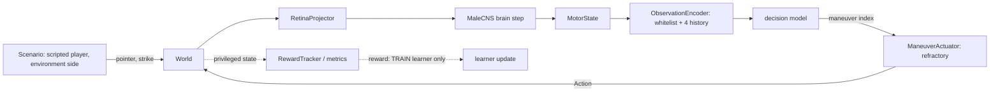

# M2.0: learning infrastructure and baseline benchmark

Status: **infrastructure complete; baseline benchmark run. Go/no-go for learned-policy
training: NO-GO.** The benchmark found reward exploits and a scenario-exposure loophole,
which must be fixed first (section 10).

- **Branch:** `feature/m2-0-learning-infra`, created from the accepted runtime (M1.8-N4B5R
  @ `363a1a9`).
- **Accepted runtime unchanged:** no accepted runtime file was changed; a test checks
  this. The game still builds the frozen `FixedEscapePolicy` (N4B1C decoder, G3 geometry).
- Nothing was merged and no policy was trained.

## 1. Summary

| Item | Result |
|---|---|
| TRAIN / EVAL separation | implemented; disjoint seed registry; EVAL parameter guard; EVAL deterministic (tested) |
| Observation contract | the M1.5 whitelist (4 neural + 4 motion + behavior_state) with 4 history frames, 60 floats; built by the existing `game.recording.observation_frame`; `MotorState.trace` excluded (tested) |
| Action contract | 11 body-frame maneuvers mapped to the existing `Action`; accepted 0.4 s escape refractory enforced; no x / y output (tested) |
| Baseline | accepted N4B1C `FixedEscapePolicy`, built unchanged by `build_policy` |
| Controls | no escape, random legal maneuver, simple fixed maneuver rule |
| Exploit probes | always escape, constant turning |
| Frozen benchmark | 7 scenarios x 20 EVAL seeds, suite sha256 `884de583...7e1e`, frozen at commit `20899c9` before any benchmark or training run |
| Benchmark | 840 EVAL episodes, 430 simulated minutes, exact reproducibility manifest |
| Tests | 23 new; full suite **450 / 450** pass; protected files 20 / 20; `verify_results.py` passes |
| Go / no-go | **NO-GO**: the proposed reward v1 ranks `no_escape` and the constant-turn probe above the accepted baseline, and policies that never perch avoid the perched-strike scenario |

## 2. TRAIN / EVAL architecture

Module: `game/learning/runmode.py`.

| Mode | Parameter updates | Exploration | Seeds | Trajectory recording |
|---|---|---|---|---|
| **TRAIN** | allowed | yes (sampling from the policy) | TRAIN range 20,000,000-29,999,999, drawn by `train_seeds(master_seed, n)` | (observation, maneuver) per tick, plus per-tick reward, returned by the runner |
| **EVAL** | **forbidden** (`EvalGuard`: model frozen, parameter hash checked before and after) | no (greedy) unless part of a frozen policy | EVAL seeds only, `3,000,000 + 100,000 x (scenario index + 1) + k` | none |

- `RunMode.check_seed` rejects TRAIN seeds in EVAL and EVAL seeds in TRAIN (tested).
- Both ranges are disjoint from each other and from every M1 seed (all M1 seeds are
  below 1,000,000, plus ROOM 7101-7680).
- The existing `game/modes.py` (`training`, `evaluation`) is unchanged. `RunMode` is the
  learning-side guard.

Data flow per tick, unchanged runtime path:

The reward and metrics never flow back into the observation (tested: changing the reward
cannot change an EVAL episode).

## 3. Observation contract

Module: `game/learning/contracts.py`.

- **Per frame (12 floats):**
  - validity flag;
  - `dnp01_left`, `dnp01_right`, `dna02_left`, `dna02_right`;
  - `forward_speed`, `lateral_speed`, `yaw_rate`, `saccade_remaining`;
  - behavior_state one-hot (CALM, ALERT, ESCAPE).
- **Observation (60 floats):** the current frame plus 4 history frames (most recent first,
  zero-padded, validity flag 0).
- **Frame construction:** each frame comes from `game.recording.observation_frame`, the same
  whitelist function the recorder uses.
- **Not observable:** mouse or pointer, swatter pose or phase, world pose, distances,
  collision state, Retina theta / theta_dot / azimuth, LC4 / LPLC2 activity or drive, the
  full descending-neuron trace, lifecycle / contact / surface, odor / food / perch, hidden
  geometry, target direction.

Leakage tests (`test_m2_learning.py`):

- the set of observation field names equals the whitelist exactly;
- each frame equals the recorder whitelist values;
- changing `MotorState.trace` (the full DN trace) does not change the observation;
- history is limited to 4 frames;
- only a `MotorState` is accepted; behavior states outside CALM / ALERT / ESCAPE are
  rejected;
- the observation array is read-only;
- an AST check: the policy-side modules (`contracts`, `policies`, `model`, `runmode`) import
  only `game.action`, `game.recording`, intra-package modules, numpy and the standard
  library. No world, perception, room, lifecycle, ecology, session or scenario code;
- `ManeuverPolicy.decide` takes only the MotorState;
- a live-session spy: every observation the model received equals a fresh encoding of the
  MotorState stream;
- a changed reward specification leaves an EVAL trajectory bit-identical.

## 4. Action contract

The learned policy outputs one of 11 maneuvers. Each maps to one existing `Action`, which the
world executes through the unchanged flight dynamics, walls, lifecycle (escape takeoff) and
brain stepping.

| # | Maneuver | Action |
|---|---|---|
| 0 | NONE | no command |
| 1-2 | TURN_LEFT / TURN_RIGHT | turn -0.5 / +0.5 (x world turn rate) |
| 3-4 | ALERT_SACCADE_LEFT / RIGHT | saccade -0.6 / +0.6 (bounded alert pulse) |
| 5-6 | ESCAPE_LEFT / RIGHT | escape impulse, lateral -1 / +1 with the accepted forward bias 0.35, strength 1, escape saccade |
| 7-8 | ESCAPE_FORWARD / BACKWARD | escape impulse along / against heading, strength 1 |
| 9-10 | ESCAPE_LEFT_HALF / RIGHT_HALF | as 5-6 at strength 0.5 |

- **Escape refractory:** `ManeuverActuator` enforces the accepted `policy.refractory_seconds`
  (0.4 s). Escape requests inside it execute as NONE and are counted. An escape therefore
  cannot fire more than once per 0.4 s (tested).
- **behavior_state:** ESCAPE during the refractory; ALERT for 0.2 s after a turn or saccade;
  otherwise CALM.
  - It feeds the session's ecology / lifecycle threat state exactly as
    `FixedEscapePolicy.diagnostics()` does.
  - It is the policy's own pre-action state inside the observation.

## 5. Frozen benchmark suite and seed split

Modules: `game/learning/scenarios.py` and `runner.py`.

- The suite was frozen at commit `20899c9` (sha256 pinned in a test) before any benchmark
  or training run.
- Each scenario uses 20 EVAL seeds.
- Scenario code plays the human / experimenter. It reads the world to aim the paddle, but
  nothing it computes reaches a policy.

| # | Scenario | Definition | Horizon | EVAL seeds |
|---|---|---|---|---|
| 0 | direct_strike | scripted player tracks the fly and clicks within a per-strike trigger distance | 20 s or death | 3,100,001-3,100,020 |
| 1 | hover_chase | hovers 150-260 units beside the fly for 1.5-3.5 s, then attacks; repeats | 20 s or death | 3,200,001-020 |
| 2 | glancing_pass | fast sweeps at 250-450 units miss, 900-1500 units/s; never strikes | 20 s | 3,300,001-020 |
| 3 | aborted_approach | approaches 600-800 -> 300-420 units at 400-700 units/s, retreats; never strikes | 20 s | 3,400,001-020 |
| 4 | free_flight | no player, paddle parked | 60 s | 3,500,001-020 |
| 5 | wall_edge_strike | fly starts 1.5-3 BL from a wall (6 / 20) or in a corner (14 / 20); scripted attacks | 20 s or death | 3,600,001-020 |
| 6 | perched_strike | no player until the fly perches (<= 150 s), then attacks for 10 s | <= 160 s | 3,700,001-020 |

**Scripted-player calibration** (geometric, not neural), from 52 strikes in the recorded
human sessions:

- **Trigger distance:** drawn from U(50, 350) units for each strike. At the click, the human
  paddle-to-fly distance was p10 about 50-130 units, median 130-300, p75 185-615.
- **Tracking:** the pointer follows where the fly was 0.05-0.30 s earlier, with a slowly
  varying aim error (standard deviation 0-80 units).
- **Resulting hit rate:** 62 % per strike against the baseline, against 21 / 52 = 40 % for
  humans. The scripted player is somewhat harder than a human.

**Seed split:**

- EVAL: the 140 seeds above;
- TRAIN: 20,000,000-29,999,999 (random draws);
- brain-noise seed: seed + 977;
- no overlap with each other or with M1.

## 6. Baseline benchmark (EVAL, 840 episodes)

- Commands: `python tools/m2_benchmark.py run --worker K --workers 7`
  (`NUMBA_NUM_THREADS=1`), then `report`.
- Artifacts: `artifacts/m2_0/benchmark/` (git-ignored):
  - `report.json`, sha256 `811933fd...9c90`;
  - `manifest.json`, sha256 `937d2cbc...90ff`.
- The 840 episodes were run at the suite-freeze commit `20899c9` (clean tree).
- The report and manifest were regenerated offline at `00105dc` (clean tree). That commit
  adds only the ecology-avoidance diagnostic and the report fields; it changes no simulation
  code, and the report hash is unchanged.
- The manifest records the code commit, config sha256 `053bc821...`, NUMBA threads 1, seeds,
  schemas, reward, suite hash and pooled metrics.

Pooled over all 7 scenarios:

| Policy | Hit rate per strike | Escape-assisted survival per strike | Escapes / min | Unnecessary escapes / min | Wall contact | Near wall | At >= 0.9 max speed | Slow while airborne | Turning active | Saccades / min | Perches / min | Action entropy (bits) |
|---|---|---|---|---|---|---|---|---|---|---|---|---|
| **baseline_n4b1c** | **0.620** | 0.326 | 10.4 | **4.5** | 0.023 | 0.11 | 0.002 | 0.036 | 0.06 | 56 | **0.74** | 0.18 |
| no_escape | 0.748 | 0 | 0 | 0 | 0.003 | 0.04 | 0 | 0.048 | 0 | 0 | 0.87 | 0 |
| random_legal | 0.584 | 0.307 | 145 | 132 | 0.044 | 0.12 | 0.054 | 0.016 | 0.40 | 642 | **0** | 1.83 |
| fixed_maneuver | **0.485** | 0.479 | 20.9 | **10.5** | 0.036 | 0.12 | 0.024 | 0.037 | 0.02 | 48 | 0.68 | 0.07 |
| probe_always_escape | 0.545 | 0.333 | 150 | 134 | 0.015 | 0.06 | 0.147 | 0.018 | 0 | 0 | **0** | 0.29 |
| probe_constant_turn | 0.811 | 0 | 0 | 0 | 0.011 | 0.06 | 0 | 0.007 | 1.00 | 0 | **0** | 0 |

Hit rate per strike by scenario:

| Policy | direct | hover / chase | wall / edge | perched (reached / 20) |
|---|---|---|---|---|
| baseline_n4b1c | 0.59 | 0.65 | 0.69 | 0.57 (20) |
| no_escape | 0.69 | 1.00 | 0.77 | 0.62 (20) |
| fixed_maneuver | 0.53 | 0.44 | 0.69 | 0.37 (20) |
| random_legal | 0.62 | 0.68 | 0.49 | - (**0**) |
| probe_always_escape | 0.47 | 0.58 | 0.59 | - (**0**) |
| probe_constant_turn | 0.80 | 0.87 | 0.77 | - (**0**) |

Unnecessary escapes / min in the no-strike scenarios (glancing / aborted / free flight):

| Policy | glancing | aborted | free flight |
|---|---|---|---|
| baseline_n4b1c | 8.5 | 22.6 | 0.0 |
| fixed_maneuver | 22.5 | 37.0 | 2.2 |

Observations:

- **The accepted escape helps.** The baseline's hit rate per strike is 0.62, against 0.75
  with no escape and 1.00 with no escape under hover / chase.
- **The simple fixed rule dodges better but at a cost.** `fixed_maneuver` escapes on any
  summed DNp01 >= 1.45: 0.485 hits per strike, but 2.3x the unnecessary escapes, 2.2
  unnecessary escapes per minute of free flight (baseline 0.0), and about 12x the max-speed
  fraction (0.024 against 0.002).
- **The opportunity for a learned policy** is therefore the trade-off between hit rate and
  unnecessary escapes. It is not raw hit rate.
- **Episode survival is not informative in strike scenarios.** The scripted player keeps
  attacking for 20 s, so every policy eventually dies. Hit rate per strike and exposure are
  the meaningful measures.
- **Lifecycle:** no stuck landing approaches for any policy. The baseline perches 0.74 times
  per minute; policies that turn or escape constantly never perch.
- The M1 slow-approach limitation carries over unchanged. The learned policy sees the same
  DN signals, so it inherits the input ambiguity documented in N4B8.

## 7. Anti-cheating diagnostics

Module: `game/learning/metrics.py`. Thresholds are frozen absolute margins over the accepted
baseline.

| Diagnostic | Rule | Baseline | Triggered by |
|---|---|---|---|
| wall_hugging | near-wall fraction > baseline + 0.10 and > 1.5x baseline | - | none (no policy seeks walls) |
| max_speed_flight | fraction at >= 0.9x max speed > baseline + 0.05 | - | random_legal, probe_always_escape |
| constant_turning | turning-active fraction > 0.5, or turn-sign switches > 5/s | - | probe_constant_turn |
| freezing | airborne slow fraction > baseline + 0.10 | - | none |
| spawn_exploit | an escape in the first 1 s of > 50 % of episodes | - (0.25) | random_legal, probe_always_escape |
| paddle_timing_exploit | > 50 % blind escapes (summed DNp01 < 0.5) and > 30 % of strikes preceded by a blind escape | - | random_legal, probe_always_escape |
| **ecology_avoidance** (added after the v1 run) | perches / min < 0.5x baseline | - | random_legal, probe_always_escape, probe_constant_turn |

- **Every exploit probe triggers the diagnostics it was built for.**
- **The baseline and the two sensible controls trigger none.**
- The detectors therefore work at least against these deliberate exploits.
- `ecology_avoidance` was added after the benchmark, as a diagnostic only. The frozen
  suite, seeds and policies are unchanged, and the report was recomputed offline.

## 8. Proposed reward (research only; v1 rejected by the benchmark)

Module: `game/learning/reward.py`. The reward is computed from privileged world state and
never observed.

| Term | Weight | Definition |
|---|---|---|
| death | -10 | the fly is hit |
| strike_survived | +1 | a committed strike resolves as a miss |
| unnecessary_escape | -0.2 | an escape while no strike is committed and the paddle is > 310 units away |
| speed_cost | -0.05 x max(0, speed / cruise - 1.5)^2 per s | blocks permanent max speed |
| wall_contact | -0.5 per s | blocks wall hugging |
| turn_cost | -0.01 x abs(turn) per s, -0.01 per saccade | blocks constant turning |

- No survival-time reward: a timeout gives nothing and episodes are truncated, so there is
  no timeout exploit.
- No landing / perching term.
- No proximity shaping.

**Mean episode reward v1 (all 7 scenarios):**

| Policy | Mean reward |
|---|---|
| probe_constant_turn | **-4.63** |
| no_escape | **-5.61** |
| baseline | -6.07 |
| fixed_maneuver | -6.65 |
| random_legal | -28.3 |
| probe_always_escape | -31.2 |

**v1 fails its sanity requirement.** It prefers doing nothing and constant turning over the
accepted baseline, for three reasons:

- **The death term does not discriminate.** In strike scenarios every policy is eventually
  hit, so death (-10) is paid equally, while escapes cost unnecessary-escape and saccade
  penalties.
- **Surviving a strike is worth too little.** +1 per survived strike cannot outweigh those
  penalties over one episode.
- **Exposure loophole.** Policies that never perch never face the perched attack. The
  constant-turn probe scores -2.5 there, against -9.8 for the baseline.

**Exploratory check** (offline, on the same EVAL episodes; not a validation, and not used
for any decision):

- Setting +3 per survived strike, cutting the saccade cost to -0.002 and excluding the
  perched scenario still leaves no_escape (-4.68) and constant turning (-4.75) at or above
  the baseline (-4.81).
- **Reweighting alone does not fix it; the episode structure must change** (section 10).

## 9. Proposed first learned model

`game/learning/model.py` (implemented forward pass only; not trained):

- **Architecture:** MLP 60 -> 32 (tanh) -> 11 maneuver logits, categorical policy,
  **2,315 parameters**.
- **Input scaling:** fixed, documented constants. No learned normalisation, which would be
  another source of train / eval drift.
- **No recurrence:** history is already in the observation (4 frames of the allowed fields).
- **Training method** (for the milestone after the fixes): policy gradient (REINFORCE with
  a baseline, or a small PPO) on TRAIN seeds.
  - The TRAIN pipeline is exercised by a test: trajectory collection, return computation,
    one score-function update. EVAL refuses updates.
- **Throughput:** the benchmark simulated 430 min in about 40 min wall time on 7 workers
  (about 10 simulated minutes per wall minute). The brain step dominates.

## 10. Go / no-go

**NO-GO for learned-policy training.** Per the milestone rule, training must not start while
the infrastructure shows reward exploits:

1. **Reward v1 is exploitable:** no-escape and constant turning outrank the accepted
   baseline.
2. **Scenario-exposure loophole:** a policy can avoid the perched-strike scenario by never
   perching, and so gains survival and reward.

**No leakage was found:** observation isolation, reward isolation, action bounds, TRAIN /
EVAL separation and determinism all pass.

**Required before any training** (infrastructure / research only; each is a new frozen
version, recorded in manifests):

- **Benchmark suite v2:**
  - make threat exposure policy-independent. For example, if the fly has not perched by
    the deadline, the perched scenario attacks the airborne fly;
  - deliver a fixed number of strike trials per episode, each a separate short episode, so
    hit probability per strike is measured directly;
  - keep the v1 suite frozen as a record.
- **Reward v2:** a per-strike-trial objective, -1 per hit and 0 per miss, with the rate of
  unnecessary escapes handled as a **constraint** (for example, not above the baseline's
  4.5/min, via a Lagrange multiplier) instead of a fixed small penalty. Keep the speed,
  wall and turn costs as anti-exploit terms.
- **Validate reward v2 on TRAIN-seed probes, not EVAL.** Before freezing, v2 must rank the
  baseline above no_escape, constant turning and always-escape on fresh TRAIN seeds.
  Only then freeze v2 and start small-scale training of the proposed MLP.
- **Evaluate learned policies** as a Pareto comparison with the baseline (hit rate per
  strike against unnecessary escapes per minute), plus every anti-cheat flag. None may fire.

This does not require any runtime change. It stays within M2 infrastructure.

## 11. Reproducibility

Every run manifest (`runner.run_manifest`) records:

- code commit and dirty flag;
- config path, sha256 and version;
- NUMBA threads;
- policies, EVAL seeds and TRAIN seeds;
- suite version and sha256;
- observation schema and action schema;
- reward specification;
- model architecture, parameter count and checkpoint sha256;
- final metrics.

Checkpoints and benchmark artifacts stay under the git-ignored `artifacts/m2_0/`.

| File (branch `feature/m2-0-learning-infra`) | Role |
|---|---|
| `game/learning/{contracts,policies,model,runmode,scenarios,reward,metrics,runner}.py` | infrastructure |
| `tools/m2_benchmark.py` | frozen benchmark runner / report |
| `test_m2_learning.py` | 23 contract, isolation, separation and preservation tests |
