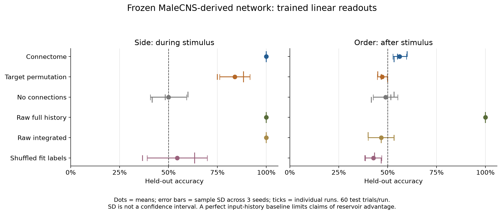
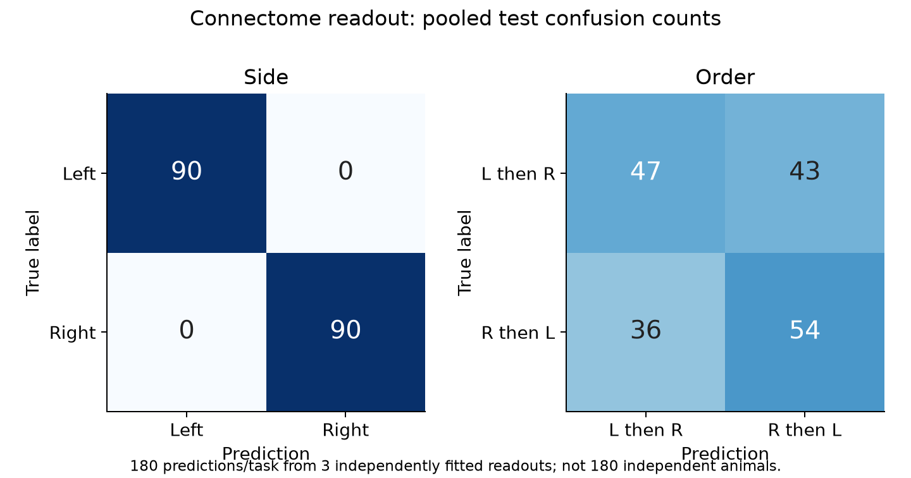
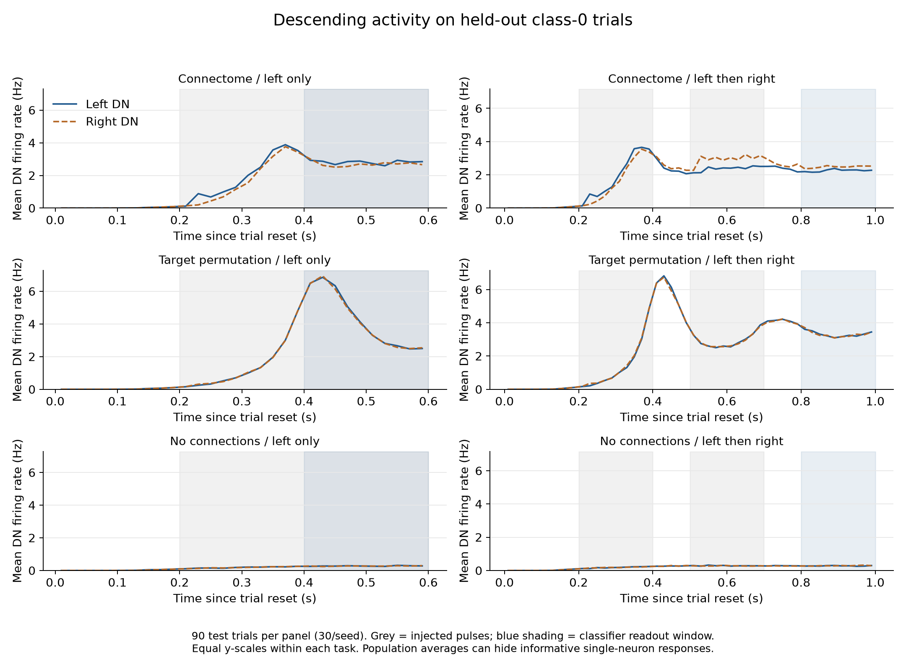

# 首次 CPU 实验结果

本实验冻结网络全部连接权重，只拟合读取下降神经元活动的线性分类器。输入是直接注入 LC4/LPLC2 特征神经元的电压；不是完整眼睛处理图像，也不是果蝇大脑学会了任务。

## 测试集准确率

每项任务每个种子使用 60 训练、20 验证、60 测试试验；3 个独立数据/噪声种子。表中为平均值 ± 样本标准差，单位是百分比/百分点；不是置信区间。

| 方法 | 左右辨别 | 延迟顺序辨别 |
|---|---:|---:|
| 真实连接 | 100.0% ± 0.0 | 56.1% ± 3.5 |
| 目标神经元重排 | 83.9% ± 7.7 | 47.2% ± 2.5 |
| 无连接 | 50.0% ± 9.3 | 48.9% ± 6.3 |
| 原始完整刺激历史 | 100.0% ± 0.0 | 100.0% ± 0.0 |
| 原始刺激积分 | 100.0% ± 0.0 | 46.7% ± 6.7 |
| 打乱拟合标签 | 54.4% ± 15.4 | 42.8% ± 4.2 |
| 理论机会水平 | 50% | 50% |

## 如何解释

1. 原始完整刺激历史可以直接提供标签。左右辨别的高准确率只验证输入到下降神经元之间存在可解码信号，不能说明真实连接优于一般机器学习模型。
2. 顺序任务两侧积分输入严格相等，读取活动时刺激已撤去。它检验短暂状态/最近侧记忆；最后一次刺激的侧别本身就确定标签，所以不能称为复杂顺序计算或长期记忆。
3. 重排对照仅打乱目标神经元身份，保留每个源的出度和权重、入度分布及归一化行和分布；它同时破坏解剖定位和输入输出对应关系。即便真实连接更好，也不能据此独立归因于精细拓扑。

- 左右任务真实连接减重排连接的配对差值：+11.7, +25.0, +11.7 个百分点；平均 +16.1。仅描述 3 次配对重复，不做显著性或生物泛化声明。
- 顺序任务真实连接减重排连接的配对差值：+15.0, +8.3, +3.3 个百分点；平均 +8.9。仅描述 3 次配对重复，不做显著性或生物泛化声明。

每次测试的 Wilson 95% 区间见下表；这些区间以该次已拟合模型为条件，不覆盖模型选择、动物差异或参数不确定性。

| 任务 | 种子 | 真实连接正确数 | Wilson 95% 区间 |
|---|---:|---:|---:|
| side | 101 | 60/60 | 94.0%–100.0% |
| order | 101 | 36/60 | 47.4%–71.4% |
| side | 202 | 60/60 | 94.0%–100.0% |
| order | 202 | 33/60 | 42.5%–66.9% |
| side | 303 | 60/60 | 94.0%–100.0% |
| order | 303 | 32/60 | 40.9%–65.4% |

## 活动与运行成本

共模拟 2,520 次完整试验。正式运行总耗时 **202.9 秒**（含数据校验、JIT、模拟、分类器与保存；不含画图和安装）。

| 网络 | 平均全网放电率 Hz | 读出窗口满步放电比例 | 含采集开销 ms/步 |
|---|---:|---:|---:|
| 真实连接 | 2.270 | 0.033% | 2.347 |
| 目标神经元重排 | 2.172 | 0.000% | 2.216 |
| 无连接 | 0.199 | 0.000% | 1.220 |

当前 CPU 成本足以继续小规模实验，暂不安装 GPU 依赖。已检测到 RTX 4060 Laptop GPU / 8188 MiB，但尚未测量 GPU 速度、峰值显存或 CPU/GPU 统计一致性。扩大试验数、扫描延迟/噪声或加入更严格重连对照时，再单独做 GPU 基准。

## 可复现记录与局限

- `manifest.json`：完整参数、数据/源码 SHA256、版本、各条件耗时、权重冻结验证。
- `trials.csv`：每个试验的划分、标签、强度、噪声种子；`metrics.json`：测试预测及所选正则化参数。
- `population_traces.npz`：绘图使用的测试集群体轨迹；大一些的单神经元活动与拟合模型在本机 `artifacts/results/`，被 Git 排除。
- 三次重复来自同一个解剖图；固定一个编码器子集、单一 LIF 参数组、短时重置试验。无法估计跨个体泛化、稳态行为或真实生理反应。
- 默认保留感觉神经元反馈；上游已描述部分感觉回路的高自发活动问题。未在当前任务上扫描该选项，以避免测试集调参。
- 无连接/标签打乱对照的偏离 50% 应结合小测试集波动理解；本次只有 3 组重排网络，不足以做稳健的结构优势推断。
- 后续应另建未查看过的测试集，增加重复和延迟梯度，加入逐神经元有符号入/出度匹配的重连对照，以及末次侧别相同、只有更早历史不同的任务。

方案、来源和数据许可见 [PROTOCOL.md](../PROTOCOL.md)。
