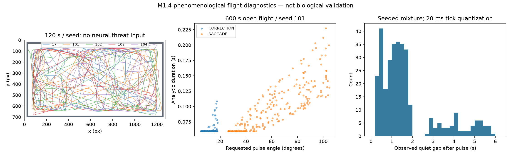

# M1.4 validation and human playtest handoff

Completed locally on `wip/m1-4-enclosure`, continuing Claude WIP `182c5a9`; stable M1.3 is `85f987b279dbd2b1f725fa79aa299281259258ab`. This report records validation before the separately authorized M1.4 commit. The baseline is committed before M1.5 development; no push was requested. No M2, training, RL or main merge.

## Validation evidence

| Check | Actual result |
|---|---|
| Initial consistency gate | 108 tests passed, 16.636 s, before completing the flight audit |
| Final `python -m unittest discover -v` | **134 tests passed**, 17.803 s; 26 added beyond the consistency baseline |
| `git diff --check` | Passed, no whitespace errors |
| Calibration provenance | Both local and tracked records exactly match the current in-memory config; startup resolves threshold 1.45 |
| Protected experiment | **20/20 SHA256 hashes unchanged**, using `artifacts/m1-2/protected-before.json` |
| Original results | **36/36 predictions** and **2/2 exact held-out neuronal replays** verified; frozen graph/weights verified |
| Historical verification file | Verification produced identical JSON; its write was intercepted to preserve the file |
| Historical chase records | M1.2 and M1.3 files unchanged relative to stable M1.3 |
| Headless | `python -m game.app --smoke 3` exited 0 |
| Actual Windows display | SDL `windows` backend; 1280×720 window, 1920×1080 fullscreen; 76 frames; physical R from pause and H passed |
| Visual inspection | Both saved window/fullscreen frames keep HUD values within the panel; trajectory figure inspected |

Full test log: `artifacts/m1-4-tests-final.txt`. Native render evidence: `artifacts/m1-4/windows-render.json` and `windows-windowed.png` / `windows-fullscreen.png`. This smoke is not a sustained FPS benchmark. The final HUD calls the open-space zone `interior` (the earlier captured frame said `open`); there is no physical opening.

## Flight scale and measured distributions

Body polygon: **24 px**, wings excluded. Cruise target: **160 px/s = 6.666667 BL/s**. Configured speed cap: **1,000 px/s = 41.666667 BL/s**. No real-world physical calibration is claimed.

The fixed, wall-free 600 s run uses seed 101, dt 0.02 s, and produces 329 accepted turns. These angle/duration statistics are actuator requests; in a full arena higher-priority preemption may interrupt them.

| Quantity | Count | Minimum | Median | p95 | Maximum |
|---|---:|---:|---:|---:|---:|
| CORRECTION angle (degrees) | 115 | 5.030839 | 11.775497 | 17.298554 | 17.927618 |
| CORRECTION duration (s) | 115 | 0.060000 | 0.060000 | 0.085990 | 0.108364 |
| SACCADE angle (degrees) | 214 | 26.201174 | 61.427724 | 102.061716 | 104.814759 |
| SACCADE duration (s) | 214 | 0.060000 | 0.097063 | 0.175738 | 0.227215 |
| Quiet gap after pulse (s) | 328 | 0.300000 | 1.330701 | 5.108934 | 5.900000 |
| Onset interval (s) | 328 | 0.360000 | 1.400000 | 5.253000 | 5.960000 |

Timing is 28% U(0.3,0.7), 54% U(0.8,1.9), 18% U(2.6,6.0) seconds, with a ×1.7 perimeter multiplier. The quiet-time clock pauses during active pulses/neural steering. No per-frame random retry of blocked turns.

Across the open-flight, enclosure, wall-start and chase checks, maximum **actual tick yaw = 23.862822 rad/s (1367.239°/s)**, below the 31 rad/s world cap. Analytic pulse rate is separately capped at 1500°/s. Exact angle integration, nonzero finite duration, infeasible-request rejection and safe priority preemption have deterministic tests. The max duration was corrected from the WIP 0.22 s to 0.30 s; an infeasible angle/rate combination is rejected instead of silently speeding up.



## Enclosure results

Local `WallCue` fields: `expansion`, `contact_bearing`, `proximity`, `surface_bearing`, `open_ahead`. Geometry only discloses surfaces/gaps within the local 150 px horizon. Behavior sees neither wall coordinates nor map/exit waypoints. No opening is configured.

Rules: time-to-contact avoidance → shortest tangent turn tilted inward → hysteretic perimeter residence and small corrections → seeded departure into the interior. Already inward headings are not unwound by residual outward velocity. AVOID has a pulse-length-plus-0.2 s cooldown. Hard containment cancels only outward velocity and does not bounce or set heading.

| 120 s seed | Returns to interior | Hard-constraint ticks / 6000 | Longest near-wall interval (s) | Longest speed <40 px/s (s) | Rapid opposite AVOID pairs |
|---|---:|---:|---:|---:|---:|
| 17 | 18 | 0 | 4.64 | 0.00 | 0 |
| 101 | 18 | 1 | 3.90 | 0.00 | 0 |
| 102 | 18 | 10 | 4.50 | 0.20 | 0 |
| 103 | 15 | 4 | 4.14 | 0.18 | 0 |
| 104 | 18 | 1 | 7.18 | 0.00 | 0 |

Total: **16 constraint ticks / 30,000 (0.0533%)**. Max displacement is 3.2 px/tick at cruise. A rapid opposite pair means opposite AVOID signs with starts less than 0.5 s apart. None occurred in these scenarios. Near-wall means proximity ≥0.45; interior means ≤0.2. These observations are finite-sample evidence, not universal guarantees.

Eight deliberate wall/corner starts (seeds 101–108, 15 s each) all returned to the interior. Constraint ticks were **1, 1, 1, 1, 3, 6, 6, 7**; starting close to a wall with outward momentum deliberately stresses the fallback. All had zero rapid opposite AVOID pairs, max displacement ≤3.2 px/tick, and longest low-speed segment ≤0.20 s. A separate pre-contact approach test completes avoidance without any constraint contact.

## Neural chase sanity

The unchanged scripted player tracks from far away, approaches at 1.00 s and clicks at 1.90 s. First lethal frame is 2.04 s. Four predetermined seeds; no parameter selection based on survival.

| Seed | First pre-click response (s) | Lead before lethal frame (s) | Hit | Constraint ticks | Max yaw (rad/s) |
|---|---:|---:|---|---:|---:|
| 101 | 1.10 | 0.94 | True | 3 | 23.485906 |
| 102 | 1.10 | 0.94 | False | 19 | 23.654233 |
| 103 | 1.10 | 0.94 | False | 20 | 22.907904 |
| 104 | 1.00 | 1.04 | False | 35 | 23.261537 |

All 4 trials respond before the click; 1 hit and 3 misses. This small scripted set is not a difficulty estimate or evidence of learning/connectome advantage. Large neural escape impulses still require appreciably more wall fallback than baseline flight (3, 19, 20, 35 ticks respectively); repeated strikes near a wall need human review.

## Fixed-fly calibration

Command: `python tools/calibrate_escape.py --trials 28`. Position, heading and motion clocks are frozen, velocity is zero from reset, policy escape and collision are disabled. Runtime graph: 166,700 neurons and 25,088,107 edges. Balanced injections: LPLC2 91/side, LC4 55/side.

| Measurement | Result |
|---|---:|
| Threshold selected by the unchanged zero-null-crossing grid rule | **1.45** |
| No-loom mean / p99 / max | 0.0875346555 / 1.0006099457 / 1.4493297338 |
| Strike-window peak mean / min / max | 3.8059460496 / 2.7349650009 / 4.8523191363 |
| Detection / median post-click latency | 28/28 / 0.06 s |
| No-loom threshold crossings | 0/2520 |
| Measurement wall time, excluding plotting | 24.467281 s |

These are fixed-fly calibration samples, not claims of zero false alarms over arbitrary long free flight. The measured distributions match the previous fixed-fly protocol because sensory/neural parameters are unchanged. Canonical configuration SHA256:

`3371686a01c42d14d55a6bcf4d558fdeb4050ffe936dca58399a186a4987f4ab`

FlyBrain 0.1.0, encoder seed 20260917, `sensory_input=false`, neural/simulation dt 0.02 s, population rule `min-per-type-per-side-v1`, protocol `fixed-fly-v2`. Startup skips stale calibration records and requires an exact match; regression tests cover altered gain/encoder settings and stale artifact fallback.

## Scientific interpretation and remaining limits

- **Biological data:** MaleCNS connectivity/cell labels, as distributed by FlyBrain. The original 25,582,938-edge dataset is distinct from the 25,088,107-edge game runtime graph.
- **Biologically motivated phenomenology:** discrete flight turns, interval mixture, local wall-following/departure, and the hand-designed neural activity-to-action decoder. Their parameters are not physiological measurements.
- **Pure game physics:** tonic cruise, damping, collision radius, speed/yaw caps, hard containment and drawing. Geometry proxies directly supply wall cues and LC4/LPLC2 stimulation; no image-processing eye model.
- **Preserved neural causal boundary:** raw mouse/swatter coordinates stop at geometry; Retina → visual feature neurons → frozen graph → DNp01/DNa02 → fixed policy → Action remains unchanged. MotionState remains restricted. No conventional swatter AI was added.
- Broader turns briefly reduce translational speed through inertia. No claim of angular-acceleration continuity or 3D flight realism.
- Boundary collisions persist during high-impulse neural escape. No claim of complete collision avoidance or mathematically guaranteed departure under all possible actions.
- The 24 px body is smaller than the old drawing. Visibility, leading difficulty, enjoyment and skill-based hittability must be judged by a human. HUD can be hidden with H.
- Windows initialization now starts only display/font subsystems. The initial broad `pygame.init()` stalled in this environment; excluding unused subsystem probes resolved the test slowdown.
- No maximum-survival objective, fitting, classifier training, RL or plasticity was introduced.

## Files changed relative to WIP 182c5a9

Existing: `README.md`, `game/FLIGHT.md`, `game/app.py`, `game/enclosure.py`, `game/flight.py`, `game/saccade.py`, `game/world.py`, `game_config.json`, `results/game/calibration.json`, `test_game_behavior.py`, `test_game_saccades.py`, `tools/chase_sanity.py`.

New: `test_game_enclosure.py`, `tools/flight_sanity.py`, `results/game/chase_m1_4.json`, `results/game/flight_m1_4.json`, `results/game/flight_m1_4.png`, this report. Twelve tracked files show **356 additions / 147 deletions**, plus these six new untracked files. These counts describe the pre-commit validation snapshot, before the English-only documentation cleanup.

## Human playtest: 5–10 minutes

```powershell
Set-Location D:\Projects\flybrain-lab
& .\.venv\Scripts\python.exe -m game.app
```

1. Leave the swatter away for a minute: faster coherent CALM cruising, quick discrete turns, occasional long straight segments; no visible jitter or sustained stall.
2. Watch all four walls/corners: the rim should feel physical; the fly should turn before contact, sometimes follow the perimeter, then leave. Record long sticking or repeated reversals.
3. Approach without clicking from both sides: observe CALM/ALERT/ESCAPE. Confirm movement can precede clicking, while baseline/wall turns remain distinguishable from neural threat responses.
4. Try clicking directly, then lead the trajectory: both hits and misses should be achievable. Evaluate predictability and difficulty without seeking maximum survival.
5. Repeatedly strike near a wall: specifically inspect constraint sliding, stalled motion and wrong-way responses; these are the main remaining risk.
6. Check 24 px visibility, H on/off, F11 window/fullscreen, pause, physical R and Enter restart, and escape/quit. Record the seed, approach, wall/corner, state and turn label for any failure.

**Validated M1.4 baseline. The owner subsequently authorized a separate M1.4 commit followed by M1.5 environment work. No M2 learning is authorized.**
