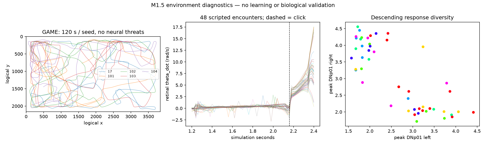

# M1.5 validation and human-playtest handoff

Status: automated validation passed; human acceptance is pending. M1.5 is
uncommitted. No push, merge, history rewrite, optimizer, RL training or
connectome plasticity was performed.

## Repository state and changes

Branch: `wip/m1-4-enclosure`.
M1.4 was validated and committed separately as
`fe2efb758a10802442edabad01e5a976f4c58b16`
(`Complete biological free-flight and enclosure model`).

Modified in M1.5:

- `README.md`, `game/FLIGHT.md`: English architecture, mode and scale documentation.
- `game/app.py`: resolution-independent rendering, mode/seed/recording CLI and HUD layout.
- `game/world.py`: seeded GAME spawn, directional physical strokes, curvature and sideslip.
- `game/fly.py`, `game/perception.py`: analysis-only LC4/LPLC2 fired-cell counts.
- `game/session.py`: mode and recorder lifecycle; pre-action observation alignment.
- `tools/calibrate_escape.py`: separate config-selected calibration destinations.

Added in M1.5:

- `game_play_config.json`: GAME preset; existing `game_config.json` remains LAB.
- `game/modes.py`, `game/recording.py`: frozen mode boundaries and interaction data.
- `game/M1_5.md`: exact algorithms, observation/log contracts and human checklist.
- `test_game_m1_5.py`: 24 deterministic regression tests.
- `tools/encounter_sanity.py`: predefined encounter and open-flight diagnostics.
- `results/game/calibration_game.json`: matching fixed-fly GAME calibration.
- `results/game/encounters_m1_5.json`, `results/game/encounters_m1_5.png`: evidence.
- `results/game/M1_5.md`: this handoff.

No original experiment sources, data or protected results were changed.
The original LAB config and seven previously committed game-result files are
unchanged under Git's checkout newline rules. Windows CRLF checkout bytes
are distinct from LF Git blobs; this is not a content change. All 20 protected
original experiment paths independently retain their exact byte SHA256 hashes.

## Executed validation

| Check | Result |
|---|---|
| `python -m unittest discover -v` | 158 passed in 21.321 s: 134 prior + 24 new |
| Original experiment verifier | 36 prediction records verified |
| Held-out neuronal replay | side/seed 101/trial 80 and order/seed 101/trial 80 both exact |
| Frozen weights / source hashes | verified |
| Protected manifest | all 20 byte hashes unchanged |
| Historical LAB/game records | unchanged |
| GAME headless smoke | `python -m game.app --smoke 3 --mode evaluation --seed 101`, exit 0 |
| LAB headless smoke | `python -m game.app --smoke 3 --mode lab`, exit 0 |
| Actual Windows rendering | SDL windows driver, fullscreen and 1280x720 window, HUD and restart pass |
| `git diff --check` | passed |
| Editable game/docs language scan | English; protected original texts left frozen |

The verifier ran through `runpy` with only its final report write intercepted:
the generated text was required to exactly equal historical
`results/verification.json`. All verification computations still ran.
The final complete test log is `artifacts/m1-5-tests-final.txt`.

Actual Windows smokes tested 2560x1440 and 1920x1080 fullscreen during this
session, plus 1280x720 windowed mode. Physical R and Enter resume a running
new episode from pause; H and F11 worked. Final render evidence is
`artifacts/m1-5/windows-render-final.json`, with screenshots in the same
folder. HUD values and bottom controls were visually inspected inside their
panels. This brief smoke is not a sustained rendering-performance benchmark.

## Calibration

Run GAME calibration with:

```powershell
& .\.venv\Scripts\python.exe tools\calibrate_escape.py --config game_play_config.json --trials 28
```

The fly position/heading remain fixed, velocity stays zero, flight clocks and
wander cannot move it, policy escape is disabled, and collision is disabled.
The unchanged LAB calibration remains 1.45. GAME independently measured:

| Measurement | GAME result |
|---|---:|
| Threshold | 1.35 |
| Detected loom trials | 28/28 |
| Median latency after click | 0.06 s |
| No-loom threshold crossings | 0/2520 ticks |
| No-loom mean / p99 / maximum | 0.073748 / 1.000002 / 1.301194 |
| Loom mean / minimum / maximum peak | 3.990424 / 2.788266 / 4.771536 |

Final canonical GAME config SHA256: `766dcc825c34b0ad5b256fb29400d424d405ac81e450dea4862ca708f2ad0341`.
Provenance also includes FlyBrain 0.1.0, fixed-fly-v2, sensory_input=false,
encoder seed 20260917 and population selection, and 20 ms neural/world ticks.
Both presets resolve exact matching records. A stale artifact is skipped;
a missing match fails with recalibration guidance. Arbitrary directional
free-flight encounters are outside this fixed-fly calibration distribution.
Zero observed null crossings is not a universal zero-false-positive claim.

The runtime has 166,700 cells and 25,088,107 connections after incoming
sensory-neuron edges are removed, versus 25,582,938 connections in the original
dataset. The dataset files themselves are unchanged.

## Scale, spawning and movement

GAME: 3840x2160 logical units = 160x90 body lengths, nine times LAB area.
Body length: 24 logical units (0.625% of arena width). Paddle diameter: 288
units = 12 body lengths. At 1920x1080 these render as 12 px and 144 px; at
2560x1440, 16 px and 192 px; at 1280x720, 8 px and 96 px. Aspect-preserving
letterboxing keeps geometry and pointer mapping consistent. Cruise is 9 BL/s;
the safety cap is 41.67 BL/s. These are game units, not measured physiology.

Spawn uses a separate seeded RNG: uniform x in [203,3637], y in [203,1957],
rejecting positions within 227 units of the initial swatter. Heading is
uniform over a full turn, initial velocity differs by at most 12 degrees,
and speed is 80-105% of cruise. Curvature phases and initial turn wait vary.
The same seed/input sequence reproduces the run. Normal PLAY starts with a
new base seed; R/Enter uses base seed + 1000 per restart. LAB/calibration keep
their controlled fixed pose.

Directional strikes fit recent world-side pointer velocity over roughly
180 ms, then commit the click-time direction and speed. Sweep speed is 45%
of capped approach speed, with a sine envelope over 0.18 s wind-up plus 0.08 s
contact. Later pointer motion cannot retarget that stroke. Orientation changes
projected visual span. Only retinal theta/theta_dot/azimuth reach the encoder;
no raw pointer or hidden click signal enters the neural policy.

Curvature is `0.16*sin(2*pi*t/7+phase1)+0.06*sin(2*pi*t/13+phase2)` rad/s,
with seeded phases and no independent frame noise. M1.4 discrete saccades use
continuous half-sine yaw pulses, 0.06-0.30 s bounds, up to 120 degrees and a
1500 deg/s actuator cap, with separate ALERT/ESCAPE limits. Seeded waits mix
short, ordinary and long intervals. Velocity direction realigns toward body
heading with a 0.28 s time constant and an 80-degree mismatch cap; speed
magnitude is preserved by that angular operation. No airflow or CFD is used.

## Encounter and boundary evidence

The predefined diagnostic uses two seeds, eight approach axes and three
pointer profiles (linear, accelerating and leading), without optimizing the
hit rate. It produced 48 distinct retinal sequences (rounded to 1e-7),
48 detected policy responses and **45 hits in 48 attacks**. The scripted
player continuously targets the fly accurately; this is not a human difficulty
estimate or a claim that the fly is now hard enough to hit.

Five seeds per preset each ran 120 s without neural threats. Near-wall time
(proximity >= 0.45) averaged 41.12% in LAB and 9.8167% in GAME. Hard-containment
ticks were 16 versus 1 out of 30,000. GAME's maximum sampled sideslip was
76.10 degrees; no GAME trajectory spent time below 40 units/s. Its longest
continuous near-wall interval was 3.16 s. These are finite samples, not a
proof against every wall pathology. This comparison changes the complete
preset (including spawn, speed and dynamics), so it does not isolate arena
size as a causal effect.

Encounter diagnostic runtime: 21.343 s, measured while other validation
was also running; this is not a standalone performance benchmark.
Full separate policy/world records: `artifacts/m1-5/encounters/runs/20260919T182446-eaff70b8`.



## Data/interface contract and scientific interpretation

See [the exact schema and algorithms](../../game/M1_5.md). Each run contains
manifest (including full config), episodes, policy_samples, world_debug and
strikes. Profile counters persist, with checkpoint=null and learning_updates=0.
Policy samples contain only neural DNp01 L/R and DNa02 L/R, body-frame
MotionState, pre-action behavior state and four previous whitelisted frames.
Current plus history span 80 ms. Selected Action and executed actuator
parameters are recorded separately from post-action outcome labels. World
coordinates, mouse trajectory, retinal summaries, true fired LC4/LPLC2 counts
and injection drive are analysis records, excluded from policy observations.
Recording versus no recording preserves exact neural and physical trajectories.

1. Direct evidence: MaleCNS anatomical connectivity and cell annotations.
2. Phenomenological approximation: LIF activity, hand-written neural decoding,
   smooth curvature, saccades, short-lived heading/velocity separation and
   local wall exploration. Exact algorithms are not identified neural circuits.
3. Game convention: scale, randomized encounters, paddle/collision geometry,
   sweep envelope, damping, safety caps, rendering and hard containment.

Limitations: no 3D roll/pitch/banking, lift or complete retinal image processing;
small body visibility and difficulty require human judgment; the hard sideslip
cone can cause an acceleration discontinuity; stationary calibration does not
span all moving attacks. Logging requires one process per profile, consumes
disk, and an abrupt kill can lose pending summaries/counters. No adaptation,
learning, connectome advantage or biological fidelity has been demonstrated.

## Human acceptance: 5-10 minutes

```powershell
Set-Location D:\Projects\flybrain-lab
& .\.venv\Scripts\python.exe -m game.app
```

1. 0-1 min: judge fullscreen space, fly visibility and paddle size; toggle H.
2. 1-2 min: restart with R/Enter several times; compare spawn/heading/course.
3. 2-3 min: keep the paddle away; inspect gentle curves and discrete rapid turns.
4. 3-5 min: approach left/right/diagonally, accelerate, then click; compare
   physical sweeps and neural HUD. Also try a stationary click.
5. 5-7 min: alternate direct pursuit and leading. Judge skill-based hittability;
   note trivial hits, excessive speed or repetitive evasion.
6. 7-8 min: inspect escape sideslip and walls for persistent sliding/hugging.
7. 8-10 min: F11, pause, R/Enter, then quit normally; inspect the new run and
   `artifacts/game/player-default/profile.json`. Report seed and input sequence
   for problems; replay with `--mode evaluation --seed N --windowed`.

Ready for human playtesting, not final M1.5 acceptance. Stop here: no M1.5
commit or push until owner playtesting; do not begin Milestone 2 learning.
