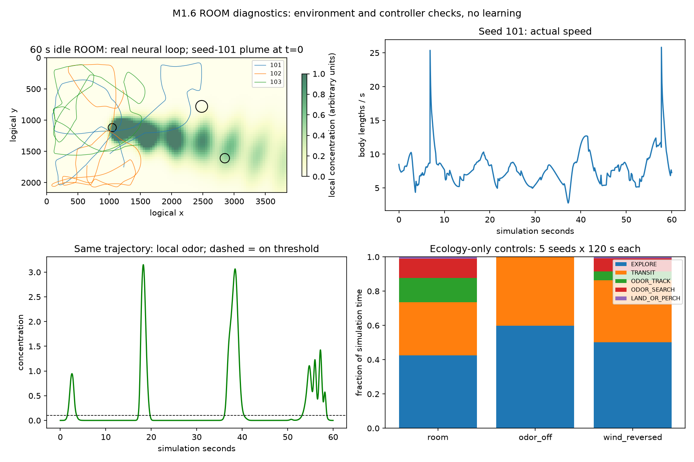

# M1.6 ecological ROOM validation

Status: automated validation passed; ready for owner playtesting. No final
M1.6 commit or push. No RL, personalized learning, plasticity or M1.5.1 speed
calibration. Branch: `wip/m1-4-enclosure`; HEAD remains M1.4 commit
`fe2efb758a10802442edabad01e5a976f4c58b16`. The previously uncommitted M1.5 work
is retained beneath this milestone.

## Validation actually executed

| Check | Result |
|---|---|
| `python -m unittest discover -v` | 194 passed in 24.122 s; 158 prior + 36 ROOM tests |
| Protected original experiment | all 20 exact byte SHA256 hashes unchanged |
| `verify_results.py` calculations | 36 prediction records, two exact neural replays, frozen weights and source hashes verified |
| LAB and GAME pre-M1.6 trajectories | each 2,000 world ticks and 300 full-neural ticks exactly equal |
| Existing LAB/GAME configs and all pre-existing game result files | byte hashes unchanged from M1.5 snapshot |
| ROOM exact-provenance calibration | matching record, threshold 1.35 |
| ROOM / ecology-disabled ROOM / LAB headless smoke | each 3 s, exit 0 |
| Actual Windows render | SDL windows driver, 1920x1080 fullscreen, 1280x720 window, H/F11 and R/Enter restart passed |
| `git diff --check` | passed |
| New/edited project language | English; frozen historical original text unchanged |

The original verifier's final report write was intercepted only to require
exact equality with the existing historical file, retaining its bytes. Its
verification computations were not skipped. M1.5 trajectory baselines were
captured before implementation in `artifacts/m1-6/baseline-replay.npz`.

Final test log: `artifacts/m1-6/tests.txt`. Render evidence and screenshots:
`artifacts/m1-6/windows-render.json`, `room-fullscreen.png`, `room-hud.png`,
`room-windowed.png`. The final HUD was visually checked inside its panel.
This short render smoke is not a sustained FPS benchmark.

## Independent ROOM calibration

Command: `python tools/calibrate_escape.py --config game_room_config.json --trials 28`.
The fly remains fixed, zero-velocity; ecology/flight clocks do not advance,
policy escape and collisions are disabled. No odor enters the visual brain.

Threshold 1.35; 28/28 detections; median click latency 0.06 s; zero threshold
crossings in 2,520 no-loom ticks. No-loom mean/p99/max:
0.073748397 / 1.000001702 / 1.301194251. Loom peak mean/min/max:
3.990423546 / 2.788265705 / 4.771536330.

ROOM canonical configuration hash: `4a80419ac105d116effbe4306e5e4a775ccc3514ba67d09cf38fb625e30bdaad`.
Separate files are `results/game/calibration_room.json` and ignored full
`artifacts/game/calibration_room.json`. LAB 1.45 and GAME 1.35 records were not
rewritten. Modifying the full config rejects mismatched calibration, even if
a changed environmental setting cannot affect the fixed-fly measurement.

## Ecological controls

Five fixed seeds (101-105), 120 simulation seconds each, per condition. These
controls run the ecological/flight layer without stepping the neural threat
network. They isolate the environment/controller behavior, not biological
source-localization performance. Same preselected seeds, no fitting to outcomes.

| Condition | EXPLORE s | TRANSIT s | TRACK s | SEARCH s | Approach s | Approach attempts | Near-wall time |
|---|---:|---:|---:|---:|---:|---:|---:|
| ROOM | 255.78 | 186.12 | 84.40 | 67.40 | 6.30 | 7 | 11.24% |
| Zero odor emission | 359.66 | 240.34 | 0 | 0 | 0 | 0 | 11.62% |
| Wind direction reversed | 301.54 | 216.52 | 30.52 | 46.92 | 4.50 | 5 | 9.82% |

Solid-object contact ticks: 60/30,000 (ROOM), 145/30,000 (odor off),
114/30,000 (reversed wind). No ecology-only ALERT/ESCAPE was fabricated.
No waypoint, food vector or source range reached the controller.
These numbers show context-sensitive state changes and finite-seed exploration;
they do not establish successful navigation or rule out rare sticking.

## Real MaleCNS closed-loop idle ROOM

Three seeds, 60 s each, swatter parked at (0,0), no clicks. This still includes
the real stochastic brain and visible distant swatter. It is not a stimulus-free
neural-null experiment. The ecological observations were recorded separately.

| Seed | Actual speed min / mean / max BL/s | TRACK s | SEARCH s | RECOVER s | Approach attempts |
|---|---|---:|---:|---:|---:|
| 101 | 2.771 / 7.879 / 25.824 | 6.44 | 1.38 | 11.72 | 2 |
| 102 | 3.671 / 7.844 / 29.684 | 2.04 | 3.16 | 15.22 | 1 |
| 103 | 4.928 / 7.519 / 33.520 | 3.82 | 1.04 | 13.08 | 0 |

All three traces encounter odor. Brief high speeds include genuine neural
impulses, not ecological speed fitting. No solid-object contact occurred in
these three finite traces. Neural ESCAPE still occurred without a click:
0.84, 1.68 and 0.84 seconds respectively. Short alerts are also present.
Recovery occupies 22.23% overall after severity-dependent recovery was added.
This remains a human-playtest concern; the existing neural policy/thresholds
were preserved, not silently filtered to make the ecological demo look cleaner.

The initial design used 1.2 s recovery after both alert and escape, consuming
roughly 60% of idle observation. M1.6 now uses 0.2 s after brief alert and 1.2 s
after actual escape; a regression covers this distinction. This is explicitly
a phenomenological controller choice, not an experimentally fitted circuit.

Six predefined directional visual encounters all activated neural/ecological
threat states and all six were hit by the scripted accurately tracking player.
Trials stop on hit; dead time is excluded. No difficulty or successful-evasion
claim follows from this test. Escape still follows the original Retina ->
LC4/LPLC2 -> MaleCNS -> descending state -> fixed policy -> Action route.

Diagnostic runtime: 41.072 s (other validation ran concurrently).
Full interaction records: `artifacts/m1-6/idle-records/runs/20260919T194711-8277fe03`.
Raw reproducible arrays: `artifacts/m1-6/room-trajectories.npz`.



## Exact model and interface

[game/ROOM.md](../../game/ROOM.md) specifies every field equation, parameter,
state transition, speed range, local cue and recording boundary. Summary:

- ROOM keeps the 160x90 body-length arena; source radius 65 units, column 95,
  future perch 75. Source/objects remain WORLD-side.
- Ambient wind: mean 45 logical units/s, +/-15% sinusoidal speed over 31 s,
  +/-12-degree direction over 45 s, seeded phases. No body force and no CFD.
- Odor: soft downstream gate, Gaussian transverse profile, width 100+0.09*d,
  exponential decay scale 2400; transport delay d/wind-speed; meander 45 units
  over 11 s and +/-35% emission modulation over 9 s. Non-radial analytic plume,
  not mass-conserving turbulent flow.
- EcologicalSense: odor, filtered odor_rate, bilateral difference, body-relative
  wind forward/lateral, local visual left/right/front/contrast, forward landing
  affordance and its expansion. Frozen slots, exact-type rejection of subclasses.
- States: EXPLORE, TRANSIT, ODOR_SEARCH, ODOR_TRACK, LAND_OR_PERCH, ALERT,
  ESCAPE, RECOVER. These are simulation abstractions.
- Configured target BL/s: 5-8, 9-13, 4-7, 9-13, 1-3, 8-12 requested,
  12-18 requested, 5-8 respectively. Targets blend with tau 0.5 s. Neural
  steering/pulses suppress ecological speed/turn requests; actual escape
  performance comes from the inherited neural impulse and flight physics.
- Odor-on threshold/dwell: 0.10/0.12 s; off: 0.065/0.45 s. Search lasts up to
  6 s. Long 8 s tracking bouts lead to a 4 s relocation convention.
- Local upwind steering, visual-contrast modulation and a persistent search
  oscillation are bounded at 0.9 rad/s, filtered with tau 0.18 s. The existing
  curvature, discrete saccades, sideslip and local wall controller remain.
- Column: local angular cues and swept disk contact. Landing: approach and
  deceleration only, with dwell/timeout/cooldown; full touchdown/perching deferred.

Recorder world_debug gains room_analysis with local cues, ecological state,
requested/applied speed, approach attempts, object contacts and true WORLD
source/objects. Neural state/player strikes remain separately identifiable.
The policy observation whitelist is unchanged; it does not automatically gain
odor, room fields or coordinates. Actual ecology enable flags and episode
interaction totals are retained. There is no learning or trained checkpoint.

## Classification and limitations

A: anatomical/connectomic evidence and published observations that attractive
odor can change free-flight speed/orientation and that visual feedback matters.
B: analytic plume/wind, ideal ambient-wind estimation, ecological state machine,
coarse visual cues, orientation/search, speed mappings, recovery and approach.
C: room layout, circles, contact solver, display, numerical safety limits and
anti-lock relocation timers. Primary references are linked in game/ROOM.md.

No complete olfactory circuit, 3D room, roll/pitch/banking, optic-flow estimator,
chemical receptor dynamics, feeding or perching is implemented. A simplified
visual-gain factor is not a reproduction of the experimental visual dependence.
The plume lacks turbulence, obstacle occlusion and full transport history.
Search oscillates about upwind and is not a complete crosswind-casting model.
Speed values are mappings, not a universal biological cruise-speed calibration.
Background neural alerts, sharp transitions, small-body visibility and prolonged
contact need human inspection. Logging is single-writer, consumes disk and may
lose pending summaries on abrupt termination. No biological fidelity,
connectome advantage or personalized learning has been demonstrated.

## Human playtest: 5-10 minutes

```powershell
Set-Location D:\Projects\flybrain-lab
& .\.venv\Scripts\python.exe -m game.app --arena room --seed 101
```

1. 0-2 min: park the swatter in a corner and press H. Does the fly explore and
   relocate on its own? Are speed/state changes interpretable or robotic?
2. 2-4 min: watch odor entry/loss and wind arrow. Look for bounded upwind/search
   tendencies, not omniscient homing or permanent food orbit.
3. 4-5 min: observe the source/column/perch. Check decelerating approach attempts,
   no teleportation and no persistent collision sticking. No touchdown is expected.
4. 5-7 min: attack from several directions. Neural threat must override ecology;
   after escape it should resume activity through recovery.
5. 7-8 min: R/Enter several times, compare routes and check F11/pause/restart.
6. 8-10 min: quit normally and compare the same seed with --no-ecology. Confirm
   LAB still starts via --mode lab. Report seed, input sequence and behavior.

The aim is meaningful ecological activity, not increased difficulty. Stop for
owner feedback before final M1.6 commit or any learning milestone.

## Files changed since the validated M1.5 snapshot

- `README.md` (modified)
- `game/FLIGHT.md` (modified)
- `game/M1_5.md` (modified)
- `game/ROOM.md` (new)
- `game/app.py` (modified)
- `game/ecological_sense.py` (new)
- `game/ecology.py` (new)
- `game/flight.py` (modified)
- `game/recording.py` (modified)
- `game/room.py` (new)
- `game/session.py` (modified)
- `game/world.py` (modified)
- `game_room_config.json` (new)
- `results/game/M1_6.md` (new)
- `results/game/calibration_room.json` (new)
- `results/game/room_m1_6.json` (new)
- `results/game/room_m1_6.png` (new)
- `test_game_m1_6.py` (new)
- `tools/room_sanity.py` (new)
